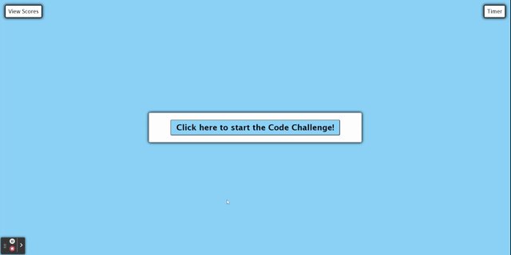

# Code Quiz

## Description
The following webpage allows the user to participate in a timed coding quiz.

* When the user clicks the start button, the first question of the quiz will appear and the timer will begin.
* During the quiz, a timer will show how much time the user has left to complete the quiz. 
    * If the user answers a question incorrectly, the time will be subtracted from the timer. 
* If the timer hits zero or when the user answers all the questions, they will reach the page where they can save their score with their initials attached. 
* After submitting their initials, a score page will show their score with their initials next to it. 
    * Their scores will also be saved onto their local storage as well. 
* The user is able to clear the scores that were saved by clicking the "Clear Scores" button.
* The user is able to restart the quiz by clicking the "Start Over".
    * The user is able to see their previous scores after they complete the quiz if they chose to not clear their scores before restarting the quiz. 
* If the user clicks the "View Scores" button at any time before or during the quiz, the timer will stop and they will be taken to the score page. 

## Technologies used

## Example

## Link
* https://jmaraya1229.github.io/CodeQuiz/